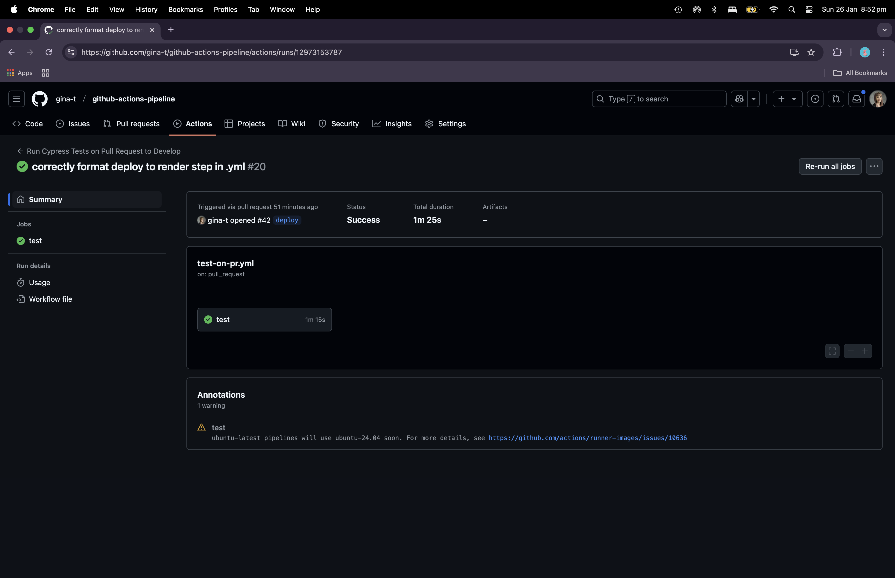
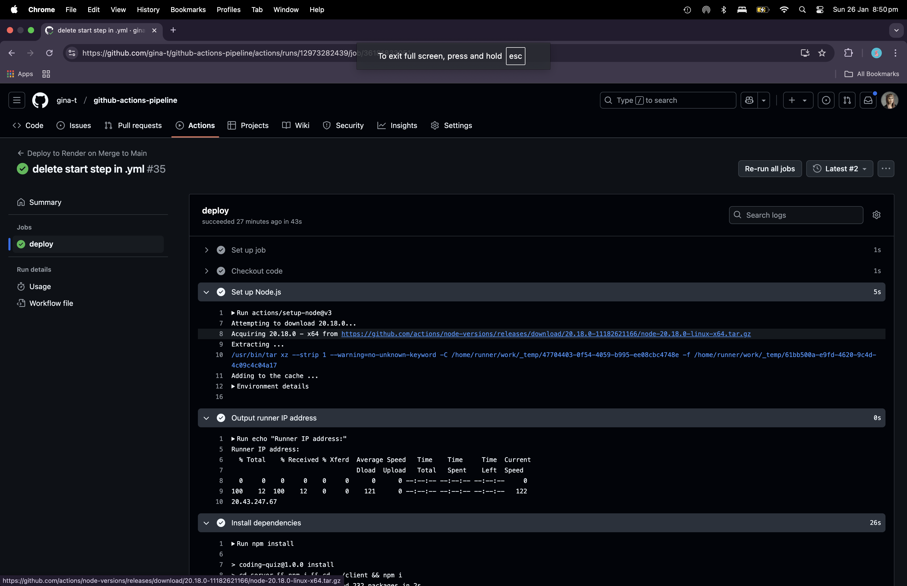
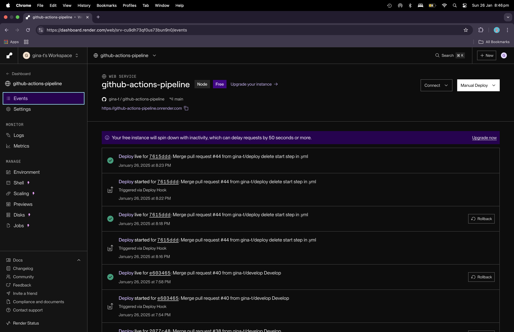

# github-actions-pipeline

## Table of Contents

- [Description](#description)
- [Installation](#installation)
- [Usage](#usage)
- [License](#license)
- [Contributing Guidelines](#contributing-guidelines)
- [Testing](#testing)
- [Authors and Acknowledgements](#authors-and-acknowledgements)

## Description

Two CI/CD pipelines created using GitHub Actions. The test-on-pr.yml is triggered when a pull request is submitted to Develop branch, and automatically executes Cypress component testing. The deploy-to-render.yml is triggered when a pull request is submitted to Main branch and merged, and automatically deploys the app to Render.

## Installation

To get started with this project, implement the following steps:

1. Clone the repo:

```zsh
git git@github.com:gina-t/github-actions-pipeline.git

```

2. In `root` directory, install dependencies:

```zsh
npm install @vitejs/plugin-react vitest
npm install concurrently cypress react react-dom ts-node typescript --save-dev
```

3. In `server` directory, install dependencies:

```zsh
npm install dotenv express mongodb mongoose 
npm install @types/dotenv @types/express @types/node msw nodemon typescript vitest --save-dev
```

4. In `client` directory, install dependencies:

```zsh
npm install bootstrap jwt-decode react react-bootstrap react-dom react-router-dom vitest 
npm install @testing-library/dom @testing-library/jest-dom @testing-library/react @testing-library/user-event @types/react @types/react-dom @vitejs/plugin-react @vitest/ui eslint eslint-plugin-react eslint-plugin-react-hooks eslint-plugin-react-refresh jsdom msw vite --save-dev
```

5. Configure TypeScript:

- `root/tsconfig.json` contains base configuration:

```json
{
"include": ["server/src"]
}
```

- `server/tsconfig.json` extends root and adds settings specific to the server-side including typeRoots:

```json
{
"include": ["src", "**/*.json"]
"typeRoots": ["./node_modules/@types", "./src/types"]
}
```

- `client/tsconfig.json` contains client specific configuration and references:

```json
{
"references": [{ "path": "./tsconfig.node.json" }]
}
```

6. In `server/src`, create `types/express` and add `index.d.ts` to ensure typescript recognises express and json:

```typescript
import { Request, Response } from 'express';

declare module 'express' 

declare module "*.json" {
  const value: any;
  export default value;
}
```

7. In `root` directory, create `.env.development` and `env.production`:

```plaintext
MONGODB_URI=mongodb://127.0.0.1:27017/techquiz
```

```plaintext
MONGODB_URI=mongodb+srv://your MongoDB Atlas connection string
```

8. In `server` directory, run build, seed and start scripts to successfully start server:

```zsh
npm run build
npm run seed
npm run start
```

9. In `root` directory, open cypress:

```zsh
npx cypress open
```

10. In `root` directory, add cypress.config.ts:

```typescript
import { defineConfig } from "cypress";
import viteConfig from "./vite.config";

export default defineConfig({
  component: {
    specPattern: "cypress/component/**/*.cy.{js,jsx,ts,tsx}",
    devServer: {
      framework: "react",
      bundler: "vite",
      viteConfig,
    },
  },
});
```

11. In `root` directory, create `.github/workflows`:

```zsh
mkdir -p .github/workflows
```

12. In `.github/workflows`, create `.yml` for two pipelines:

```zsh
touch .github/workflows/test-on-pr.yml
touch .github/workflows/deploy-to-render.yml
```

13. Open MongoDB Atlas: Cloud Document Database, and follow instructions to create a Cluster. In Network Access, add IP addresses from Render and GitHub Actions for whitelisting. In Connect, copy your connection string.

14. In Render dashboard, create a new web service and connect your repo. After the service is created, disable auto-deploy and copy the deploy hook URL.

15. In Render dashboard, add environment variables for production:

```plaintext
MONGO_DB_URI:mongodb+srv://your MongoDB Atlas connection string
```

16. In settings of your github repo, access Secrets and variables, access Actions, create two repository secrets:

```plaintext
Name: RENDER_DEPLOY_HOOK_URL
Value: deploy hook url copied from render
```

```plaintext
Name: MONGODB_URI
Value: connection string copied from MongoDB Atlas
```

17. In settings of your github repo, access Branches and add branch Ruleset:

```plaintext
Ruleset Name: github-actions
Target by inclusion pattern: develop
Target by inclusion pattern: main
Branch Rules: check require a pull request before merging, check require status checks to pass, add checks
```

18. Update `deploy-to-render.yml` with `secrets.MONGODB_URI` and `secrets.RENDER_DEPLOY_HOOK_URL`

## Usage

Link to deployed app URL:

[github-actions-pipeline](https://github-actions-pipeline.onrender.com)

Screenshots of app demonstrating functionality:

### cypress test on pull request pipeline



### deploy to render on pull request pipeline



### render dasboard deploy triggered via GitHub Actions



### deploy live


## License

[](https://opensource.org/licenses/MIT)

## Contributing Guidelines

To contribute, please follow these steps:

1. **Fork the Repository**:
   - Navigate to `https://github.com/gina-t/github-actions-pipeline`
   - Access Fork to create a copy of the repository in your GitHub account.

2. **Clone the Forked Repository**:
   - Clone the forked repository to your local machine:
     ```zsh
     git clone https://github.com/your-username/github-actions-pipeline.git
     ```
   - Navigate to the project directory:
     ```zsh
     cd github-actions-pipeline
     ```

3. **Create a New Feature Branch**:
   - Create a new branch for your feature or bug fix:
     ```zsh
     git checkout -b feature/your-feature-name
     ```

4. **Make Changes**:
   - Make your changes to the codebase.
   - Ensure your changes follow the project's coding standards and guidelines.

5. **Commit Your Changes**:
   - Stage your changes:
     ```zsh
     git add -A
     ```
   - Commit your changes with a descriptive commit message:
     ```zsh
     git commit -m "Add your descriptive commit message here"
     ```

6. **Push Your Changes**:
   - Push your changes to your forked repository:
     ```zsh
     git push origin feature/your-feature-name
     ```

7. **Create a Pull Request**:
   - Navigate to the original repository.
   - Click the "New Pull Request" button.
   - Select your feature branch from your forked repository and compare it with the Develop branch of the original repository.
   - Provide a title and description for your pull request.
   - Click "Create Pull Request" to submit your changes for review.

8. **Review Process**:
   - Your pull request will be reviewed by the project maintainer.
   - Once your pull request is approved, it will be merged into the Develop branch.

Thank you for contributing to the project.

## Authors and Acknowledgements

[email] (ginadrcoder@gmail.com)

## Questions

For enquiries, please contact me at:

[email] (ginadrcoder@gmail.com)

[github] (https://github.com/gina-t)


